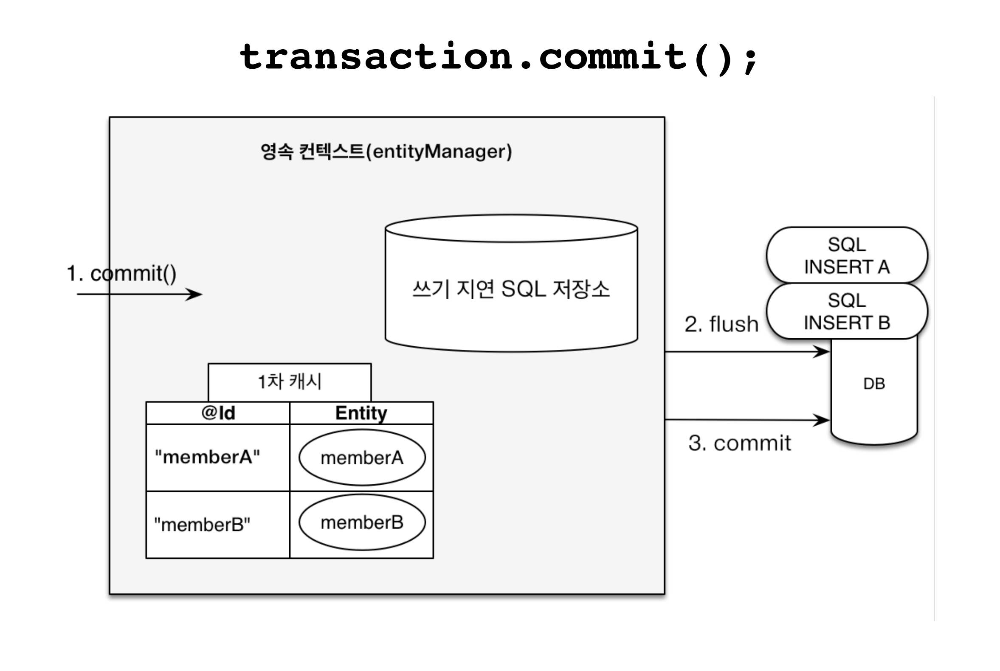

# JPA 영속성 컨텍스트 (1차 캐시)

---

## 영속성이란?

> 엔티티를 영구 저장하는 환경

### 영속성 컨텍스트의 장점

- 1차 캐시
- 동일성(identity) 보장
- 트랜잭션을 지원하는 쓰기 지연(transactional write-behind)
- 변경 감지(Dirty Checking)
- 지연 로딩(Lazy Loading)

---

### 1차 캐시

>영속성 컨텍스트는 내부에 캐시를 가지고 있는데 이것을 1차 캐시라 한다.
> 
>영속 상태의 엔티티는 모두 이곳에 저장한다.
> 영속성 컨텍스트 내부에 Map이 하나 있는데 (1차 캐시), 키는 @Id로 매핑한 식별자고 값은 엔티티 인스턴스 이다.
> 

### 1차 캐시의 흐름

1. 최초 조회할 때는 1차 캐시에 엔티티가 없다.
2. save 시 엔티티를 1차 캐시와 db에 보관한다.
3. 1차 캐시에 보관된 결과를 반환한다.
4. 이후 같은 엔티티를 조회하면 1차 캐시에 같은 엔티티가 있으므로 데이터베이스를 조회하지 않고 1차 캐시의 엔티티를 그대로 반환한다.

### 1차 캐시의 추가 특징
- 1차 캐시는 객체의 동일성 (a == b)를 보장한다.
- 1차 캐시는 한 트랜잭션 단위에서만 유효하다.

### 쓰기 지연이 가능한 이유
> 여러개의 트랜잭션을 커밋하면 함께 저장되고 롤백할때도 같이 된다.
>
> 등록 쿼리를 그떄그때 전달하던 한번에 전달하던 커밋을 하지 않는다면
>
> 소용이 없다. 어떻게든 커밋을 하기 직전에 SQL을 전달하기만 한다면 상관이 없다.
> 
